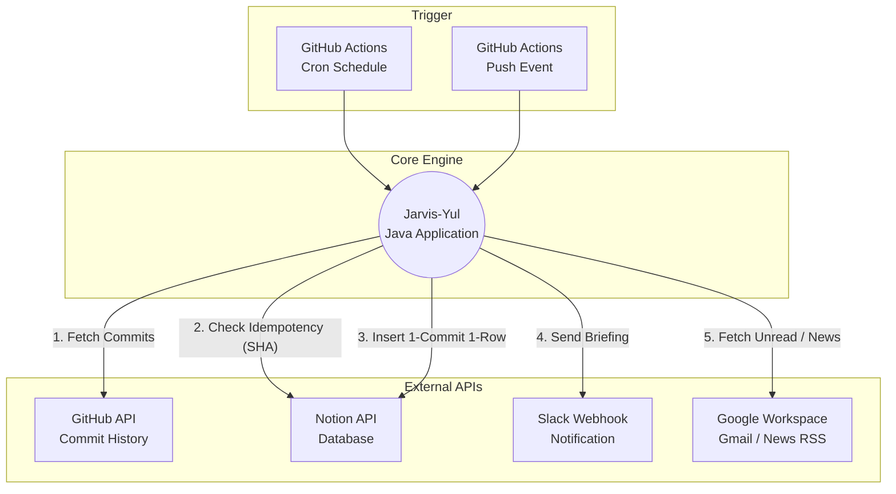

# 🤖 Jarvis-Yul : 다중 API 통합 기반 업무 자동화 파이프라인

개인 개발 생산성 향상과 데이터 로깅 자동화를 위해 구축한 **Java 기반 API 통합 파이프라인 엔진**입니다. 
GitHub, Notion, Slack, Google API 등 이기종 시스템을 하나의 비즈니스 로직으로 묶어, 개발자의 개입 없이 100% 자동화된 모니터링 및 기록 환경을 제공합니다.

 

## 🏛️ System Architecture

🔥 Core Technical Challenges (트러블슈팅)
단순한 API 연동을 넘어, 시스템 운영 중 발생할 수 있는 데이터 정합성 및 시간 오차 문제를 해결하는 데 집중했습니다.

1. 데이터 멱등성(Idempotency) 보장 로직 구현
Problem: GitHub Actions가 여러 번 트리거될 경우, 동일한 커밋 내역이 Notion 데이터베이스에 중복 적재되는 현상 발생.

Solution: Notion DB에 커밋ID 컬럼을 추가하고, 삽입 전 GitHub의 Commit SHA 값을 추출하여 Notion 쿼리(POST /v1/databases/{id}/query)를 통해 사전 검증. 동일한 SHA가 존재할 경우 Insert를 스킵하여 완벽한 데이터 멱등성 확보.

2. KST-UTC 타임존 오차에 따른 새벽 데이터 누락 해결
Problem: GitHub API의 since 파라미터가 기본적으로 UTC 00:00을 기준으로 동작하여, 한국 시간(KST) 새벽에 작업한 커밋 내역이 이전 날짜로 인식되어 수집에서 누락됨.

Solution: Java의 ZonedDateTime을 활용해 한국 기준 해당일 00:00:00을 구하고, 이를 Date.from(kstStart.toInstant())로 변환하여 API에 전달. 글로벌 서비스 환경에서의 타임존 이슈를 정밀하게 보정.

3. 멀티 레포지토리 커밋 시간순 정렬 (Sorting)
Problem: 다수의 레포지토리에서 커밋을 수집할 때, 각 레포지토리별로 최신순으로 응답이 내려와 타임라인이 꼬이는 문제 발생.

Solution: 수집된 모든 커밋을 RawCommitData 객체로 List에 담은 후, getAuthoredDate() 기준으로 전역 오름차순 정렬(Global Sorting) 수행. 실제 작업 흐름과 100% 일치하는 타임라인을 Notion에 구축.

🚀 Features
[Morning Briefing] 매일 KST 08:00 : 구글 뉴스 RSS 요약, 주요 주식(TSLA, PLTR) 시황, 중요 미확인 Gmail 스니펫 슬랙 발송.

[Real-time Commit Tracker] 메인 브랜치 Push 즉시 : 24시간 내 발생한 신규 커밋을 추적하여 Slack 요약 보고 및 Notion 데이터베이스 적재.

[Nightly Audit] 매일 KST 22:00 : 당일 커밋 내역 최종 점검 및 마감 보고.

⚙️ Environment Variables (Secrets)
보안을 위해 모든 인증 토큰은 GitHub Secrets로 분리하여 관리하고 있습니다.

GITHUB_TOKEN: 권한(repo, read:user)이 부여된 Classic Token

NOTION_TOKEN & NOTION_DB_ID: Notion API Integration Key 및 DB 인덱스

SLACK_WEBHOOK_URL: Slack Incoming Webhook 주소
