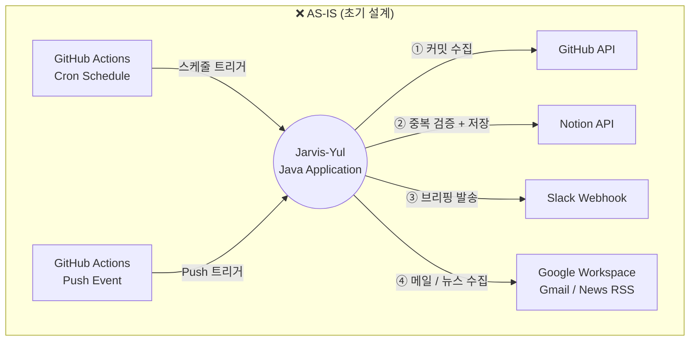
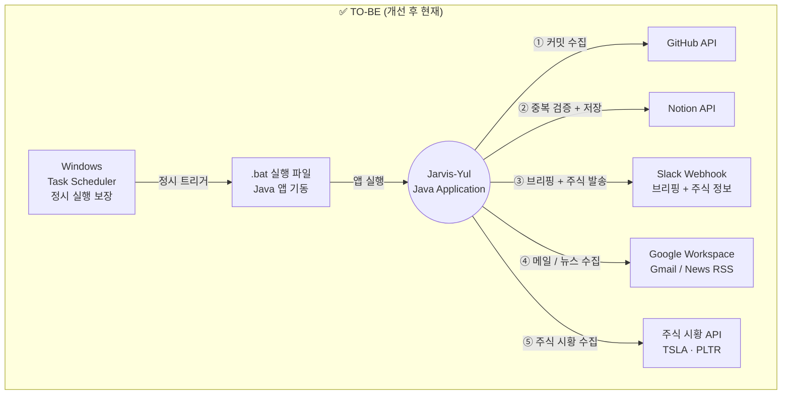

# 🤖 Jarvis-Yul : 다중 API 통합 기반 업무 자동화 파이프라인


<br>

## 💡 프로젝트 배경

매일 반복되는 커밋 기록, 뉴스 확인, 메일 체크를 수동으로 하는 데 한계를 느꼈습니다.  
**"개발자가 코드를 올리는 순간부터, 기록·알림·정리가 자동으로 이뤄지면 어떨까?"** 라는 아이디어에서 출발했습니다.

GitHub, Notion, Slack, Google 등 이기종 시스템을 하나의 Java 엔진으로 묶어  
**개발자의 개입 없이 100% 자동화된 모니터링 및 기록 환경**을 구축했습니다.

<br>

## 🏛️ System Architecture

### ❌ AS-IS : GitHub Actions Cron 방식


```mermaid
graph TD
    subgraph ASIS ["❌ AS-IS (초기 설계)"]
        A1[GitHub Actions\nCron Schedule]
        A2[GitHub Actions\nPush Event]
        A3((Jarvis-Yul\nJava Application))
        A4[GitHub API]
        A5[Notion API]
        A6[Slack Webhook]
        A7[Google Workspace\nGmail / News RSS]
    end
    A1 -->|스케줄 트리거| A3
    A2 -->|Push 트리거| A3
    A3 -- "① 커밋 수집" --> A4
    A3 -- "② 중복 검증 + 저장" --> A5
    A3 -- "③ 브리핑 발송" --> A6
    A3 -- "④ 메일 / 뉴스 수집" --> A7
```

> **문제점:** GitHub Actions Cron은 서버 부하에 따라 실행이 수십 분씩 지연되는 현상 발생.  
> 매일 08:00 브리핑이 08:40에 도착하는 등 **정시 실행을 보장할 수 없음**을 직접 운영하며 확인.

<br>

### ✅ TO-BE : Windows Task Scheduler + .bat 방식


```mermaid
graph TD
    subgraph TOBE ["✅ TO-BE (개선 후 현재)"]
        B1[Windows\nTask Scheduler\n정시 실행 보장]
        B2[.bat 실행 파일\nJava 앱 기동]
        B3((Jarvis-Yul\nJava Application))
        B4[GitHub API]
        B5[Notion API]
        B6[Slack Webhook\n브리핑 + 주식 정보]
        B7[Google Workspace\nGmail / News RSS]
        B8[주식 시황 API\nTSLA · PLTR]
    end
    B1 -->|정시 트리거| B2
    B2 -->|앱 실행| B3
    B3 -- "① 커밋 수집" --> B4
    B3 -- "② 중복 검증 + 저장" --> B5
    B3 -- "③ 브리핑 + 주식 발송" --> B6
    B3 -- "④ 메일 / 뉴스 수집" --> B7
    B3 -- "⑤ 주식 시황 수집" --> B8
```

> **개선 효과:** Task Scheduler로 정확한 시간 실행 보장.  
> 주식 시황(TSLA·PLTR) 수집 기능을 Morning Briefing에 추가하여 기능도 함께 확장.

<br>

## 🔥 Core Technical Challenges

단순 API 연동을 넘어, 실 운영 환경에서 발생한 **정합성 · 시간 오차 · 정렬 · 스케줄링** 문제를 직접 해결했습니다.

<br>

### 1. 데이터 멱등성(Idempotency) 보장

> **멱등성이란?** 같은 작업을 여러 번 실행해도 결과가 1번 실행한 것과 동일한 성질.  
> 쉽게 말해 "같은 데이터가 두 번 들어가는 걸 막는 것"

**🔴 Problem**  
트리거가 중복 실행될 경우, 동일한 커밋이 Notion DB에 여러 번 쌓이는 현상 발생.

**🟢 Solution**  
Notion DB에 `커밋ID` 컬럼을 추가하고, 삽입 전 GitHub의 `Commit SHA`(커밋 고유번호)를  
Notion 쿼리(`POST /v1/databases/{id}/query`)로 사전 검증.  
**동일한 SHA가 이미 존재하면 Insert 스킵 → 중복 적재 원천 차단.**

```
커밋 수집
    ↓
Notion에 이 SHA 있어? ──Yes──→ 스킵 (끝)
    ↓ No
Notion에 새 행 삽입
```

<br>

### 2. KST-UTC 타임존 오차에 따른 새벽 데이터 누락

> **배경:** GitHub 서버는 UTC(영국 시간) 기준. 한국(KST)은 UTC+9라서  
> 한국 새벽 1시 = UTC 전날 오후 4시로 인식됩니다.

**🔴 Problem**  
GitHub API의 `since` 파라미터가 UTC 00:00 기준으로 동작하여,  
한국 새벽에 올린 커밋이 **전날 날짜로 잘못 인식 → 수집 누락.**

**🟢 Solution**  
Java의 `ZonedDateTime`으로 한국 기준 해당일 00:00:00을 직접 계산한 뒤  
`Date.from(kstStart.toInstant())`로 변환하여 API에 전달.

```java
// KST 기준 오늘 자정을 UTC로 변환해서 API에 전달
ZonedDateTime kstStart = LocalDate.now(ZoneId.of("Asia/Seoul"))
                                  .atStartOfDay(ZoneId.of("Asia/Seoul"));
Date since = Date.from(kstStart.toInstant());
```

<br>

### 3. 멀티 레포지토리 커밋 시간순 정렬

**🔴 Problem**  
여러 repo에서 커밋을 가져오면 각 repo가 자기 기준 최신순으로 응답.  
합치면 타임라인이 뒤섞여 Notion에 순서가 엉킴.

**🟢 Solution**  
수집된 모든 커밋을 `RawCommitData` 객체 List에 담은 뒤  
`getAuthoredDate()` 기준으로 **전체 오름차순 정렬(Global Sorting) 수행.**

```
Repo A: [10:00, 14:00]  ─┐
                          ├→ 합치기 → [09:30, 10:00, 13:00, 14:00] 순 정렬
Repo B: [09:30, 13:00]  ─┘
```

<br>

### 4. GitHub Actions Cron 지연 → 로컬 스케줄러 전환

**🔴 Problem**  
초기에 GitHub Actions Cron을 트리거로 사용했으나,  
실제 운영 중 서버 부하에 따라 **수십 분씩 지연 실행**되는 현상을 직접 확인.  
매일 08:00 Morning Briefing이 08:40에 도착하는 등 정시 실행을 보장할 수 없었음.

**🟢 Solution**  
Windows Task Scheduler + `.bat` 파일 방식으로 전환하여 **정확한 시간 실행 보장.**  
GitHub Actions는 Push 이벤트 트리거 용도로만 유지.  
전환 과정에서 주식 시황(TSLA·PLTR) 수집 기능도 함께 추가하여 Morning Briefing 고도화.

> **배운 점:** 클라우드 스케줄러는 정확한 실행 시간을 보장하지 않는다.  
> 정시성이 중요한 배치 작업에서는 실행 환경과 트리거 방식을 신중하게 선택해야 한다.

<br>

## 🚀 Features

| 기능 | 실행 시점 | 내용 |
|---|---|---|
| **Morning Briefing** | 매일 KST 08:00 | 구글 뉴스 RSS 요약, 주요 주식(TSLA·PLTR) 시황, 미확인 Gmail 슬랙 발송 |
| **Real-time Commit Tracker** | Push 즉시 | 24시간 내 신규 커밋 추적 → Slack 요약 + Notion DB 적재 |
| **Nightly Audit** | 매일 KST 22:00 | 당일 커밋 내역 최종 점검 및 마감 보고 |

<br>

## 📸 실행 결과

## 📸 실행 결과

> 📌 Slack Morning Briefing 알림


> 📌 Notion 커밋 데이터베이스


<br>

## ⚙️ Getting Started

### 1. 레포지토리 클론
```bash
git clone https://github.com/devYul/polyglot-automation-hub.git
cd polyglot-automation-hub
```

### 2. 환경변수 설정

| 변수명 | 설명 |
|---|---|
| `GITHUB_TOKEN` | repo, read:user 권한이 있는 Classic Token |
| `NOTION_TOKEN` | Notion API Integration Key |
| `NOTION_DB_ID` | 데이터를 저장할 Notion DB ID |
| `SLACK_WEBHOOK_URL` | Slack Incoming Webhook 주소 |

### 3. Windows Task Scheduler 등록

```
트리거 : 매일 08:00 / 22:00
동작   : run.bat 파일 경로 지정
```

<br>

## ⚙️ Environment Variables

보안을 위해 모든 인증 토큰은 GitHub Secrets 및 로컬 환경변수로 분리하여 관리합니다.  
코드 내에 토큰을 직접 하드코딩하지 않습니다.
